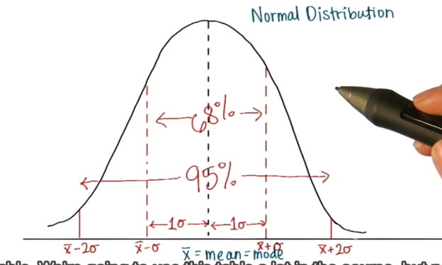

iqr 的不足 q3 -q1 =iqr
q1 q2 q3 q4

、异常值  q1 -1.5*iqr
q3+1.5*iqr

离均差 
xi  - 平均值

平均偏差
![平均偏差计算公式]:(H:\BaiduYunDownload\优达机器学习\移动端交接文档\机器学习\AI\项目二模型评估和验证\average.png)
忽略负号

平均绝对偏差公式
E|xi - x平均|
—————————————
    N

平方偏差 (xi - x平均)^2
平均平方偏差  E(xi - x平均)^2
            ————————————————
                N

标准偏差：std  =根号    E(xi - x平均)^2
              ( ————————————————  )
                     N
标准偏差意义

77-贝塞耳校正
抽样
s=根号    E(xi - x平均)^2
              ( ————————————————  )   bigger  估算总体时
                     N-1

Numpy 和 Pandas 有什么不同 
如果用 python 的列表和字典来作比较,
那么可以说 Numpy 是列表形式的，没有数值标签，而 Pandas 就是字典形式。Pandas是基于Numpy构建的，让Numpy为中心的应用变得更加简单。
要使用pandas，首先需要了解他主要两个数据结构：Series和DataFrame。

###################################################
机器学习 (Machine Learning)
在这里我们介绍了什么是机器学习, 还有机器学习包含了哪些方法. 通常来说, 机器学习的方法包括:

监督学习 supervised learning;
非监督学习 unsupervised learning;
半监督学习 semi-supervised learning;
强化学习 reinforcement learning;
遗传算法 genetic algorithm.

Scikit learn 也简称 sklearn, 是机器学习领域当中最知名的 python 模块之一.

python3使用 pip3 install scikit-learn

安装完 Sklearn 后，不要直接去用，先了解一下都有什么模型方法，然后选择适当的方法，来达到你的目标。

Sklearn 官网提供了一个流程图， 蓝色圆圈内是判断条件，绿色方框内是可以选择的算法：

 选择学习方法

从 START 开始，首先看数据的样本是否 >50，小于则需要收集更多的数据。
由图中，可以看到算法有四类，分类，回归，聚类，降维。

其中 分类和回归是监督式学习，即每个数据对应一个 label。
聚类 是非监督式学习，即没有 label。
另外一类是 降维，当数据集有很多很多属性的时候，可以通过 降维 算法把属性归纳起来。例如 20 个属性只变成 2 个，注意，这不是挑出 2 个，而是压缩成为 2 个，它们集合了 20 个属性的所有特征，相当于把重要的信息提取的更好，不重要的信息就不要了。

然后看问题属于哪一类问题，是分类还是回归，还是聚类，就选择相应的算法。 当然还要考虑数据的大小，例如 100K 是一个阈值。

可以发现有些方法是既可以作为分类，也可以作为回归，例如 SGD

混淆矩阵

recall  横轴众数/横轴总数  召回率
precision 横轴众数/横轴众数所在纵轴总数  精确率

可将 F1 分数理解为精确率和召回率的加权平均值，其中 F1 分数的最佳值为 1、最差值为 0：

F1 = 2  (精确率  召回率)  (精确率 + 召回率)

F1 = 2 * (precision * recall) / (precision + recall)

有关 F1 分数和如何在 sklearn 中使用它的更多信息，请查看此链接此处。
http://scikit-learn.org/stable/modules/generated/sklearn.metrics.f1_score.html

>>> from sklearn.metrics import f1_score
>>> y_true = [0, 1, 2, 0, 1, 2]
>>> y_pred = [0, 2, 1, 0, 0, 1]
>>> f1_score(y_true, y_pred, average='macro')  
0.26...
>>> f1_score(y_true, y_pred, average='micro')  
0.33...
>>> f1_score(y_true, y_pred, average='weighted')  
0.26...
>>> f1_score(y_true, y_pred, average=None)
array([0.8, 0. , 0. ])

均方误差
均方误差是另一个经常用于测量模型性能的指标。与绝对误差相比，残差（预测值与真实值的差值）被求平方。

对残差求平方的一些好处是，自动将所有误差转换为正数、注重较大的误差而不是较小的误差以及在微积分中是可微的（可让我们找到最小值和最大值）。

有关均方误差和如何在 sklearn 中使用它的更多信息，请查看此链接此处

回归分数函数
除了误差指标之外，
scikit-learn还包括了两个分数指标，范围通常从0到1，值0为坏，而值1为最好的表现。

虽然在课程最后的项目中，我们不会用到这两个指标，但是需要知道他们很重要。他们还有一个优点，就是看起来和分类指标类似，都是数字越接近1.0分数就越好。

其中之一是R2分数，用来计算真值预测的可决系数。在 scikit-learn 里，这也是回归学习器默认的分数方法。
http://scikit-learn.org/stable/modules/generated/sklearn.metrics.r2_score.html
另一个是可释方差分数

虽然眼下我们不会详细探讨这些指标，一个要记住的重点是，回归的默认指标是“分数越高越好”；即，越高的分数表明越好的表现。而当我们用到前面讲的误差指标时，我们要改变这个设定。

##误差原因
我们已讨论了一些用于测量模型性能的基本指标，现在来关注一下模型起初为何会出现误差。

在模型预测中，模型可能出现的误差来自两个主要来源，即：因模型无法表示基本数据的复杂度而造成的偏差（bias），
或者因模型对训练它所用的有限数据过度敏感而造成的方差（variance）。我们会对两者进行更详细的探讨。

##偏差造成的误差 - 精度和欠拟合
如前所述，如果模型具有足够的数据，但因不够复杂而无法捕捉基本关系，则会出现偏差。这样一来，模型一直会系统地错误表示数据，从而导致预测精度低。这种现象叫做欠拟合（underfitting）。

简单来说，如果模型不适当，就会出现偏差。举个例子：
如果对象是按颜色和形状分类的，但模型只能按颜色来区分对象和将对象分类（模型过度简化），因而一直会错误地分类对象。

或者，我们可能有本质上是多项式的连续数据，但模型只能表示线性关系。在此情况下，我们向模型提供多少数据并不重要，因为模型根本无法表示其中的基本关系，我们需要更复杂的模型。

##方差造成的误差 - 精度和过拟合
在训练模型时，通常使用来自较大母体（训练集）的有限数量样本。如果利用随机选择的数据子集反复训练模型，可以预料它的预测结果会因提供给它的具体样本而异。在这里，方差（variance）用来测量预测结果对于任何给定的测试样本会出现多大的变化。

出现方差是正常的，但方差过高表明模型无法将其预测结果泛化到从中抽取训练样本的较大母体。对训练集高度敏感也称为过拟合（overfitting），而且通常出现在模型过于复杂或我们没有足够的数据支持它时。

通常，可以利用更多数据进行训练，以降低模型预测结果的方差并提高精度。

##改进模型的有效性
我们可以看到，在给定一组固定数据时，模型不能过于简单或复杂。如果过于简单，模型无法了解数据并会错误地表示数据。但是，如果建立非常复杂的模型，则需要更多数据才能了解基本关系，否则十分常见的是，模型会推断出在数据中实际上并不存在的关系。

关键在于，通过找出正确的模型复杂度来找到最大限度降低偏差和方差的最有效点。当然，数据越多，模型随着时间推移会变得越好。

要详细了解偏差和方差，建议阅读 Scott Fortmann-Roe 撰写的这篇文章。http://scott.fortmann-roe.com/docs/BiasVariance.html

除了选定用来训练模型的数据子集外，您使用的哪些来自给定数据集的特征也会显著影响模型的偏差和方差？

#总结
恭喜你完成本课程！ 在本节课程中你学到了:

高效处理大量数据的数字工具
举例说明不同的数据类型，以及他们是如何产生。还提到了把他们用于标准工具的技巧
评价不同算法表现的一系列标准
优化算法表现基本的交叉验证技术
如何把学习过程和复杂度可视化，以及如何通过它选择高效的模型。
能到这一步你做的很好！我们现在把上述内容应用在一个实际项目中。你需要从数据集中做出预测，学习如何解释不通模型的优缺点，并找到一个最佳模型。

#学习曲线
让我们根据模型通过可视化图形从数据中学习的能力来探讨偏差与方差之间的关系。

机器学习中的学习曲线是一种可视化图形，能根据一系列训练实例中的训练和测试数据比较模型的指标性能。

在查看数据与误差之间的关系时，我们通常会看到，随着训练点数量的增加，误差会趋于下降。由于我们尝试构建从经验中学习的模型，因此这很有意义。

我们将训练集和测试集分隔开，以便更好地了解能否将模型泛化到未见过的数据而不是拟合到刚见过的数据。

在学习曲线中，当训练曲线和测试曲线均达到稳定阶段，并且两者之间的差距不再变化时，则可以确认模型已尽其所能地了解数据

#理想的学习曲线 见demo learn_curvetest.py 
模型的最终目标是，误差小并能很好地泛化到未见过的数据（测试数据）。
如果测试曲线和训练曲线均收敛，并且误差极低，就能看到这种模型。这种模型能根据未见过的数据非常准确地进行预测。
#模型复杂度 validation_curve
与学习曲线图形不同，模型复杂度图形呈现的是模型复杂度如何改变训练曲线和测试曲线，而不是用以训练模型的数据点的数量。
一般趋势是，随着模型增大，模型对固定的一组数据表现出更高的变化性。
#学习曲线与模型复杂度
那么，学习曲线与模型复杂度之间有何关系？

如果我们获取具有同一组固定数据的相同机器学习算法的学习曲线，但为越来越高的模型复杂度创建几个图形，则所有学习曲线图形均代表模型复杂度图形。这就是说，如果我们获取了每个模型复杂度的最终测试误差和训练误差，并依据模型复杂度将它们可视化，则我们能够看到随着模型的增大模型的表现有多好。

##问题汇总

###将数据集按一定比例分为训练用的数据集和测试用的数据集对学习算法有什么好处？
将训练用的数据集和测试用的数据集分开 可以更好的了解能否将模型泛化到未见过的数据而不是拟合到刚见过的数据。
如果用模型已经见过的数据，例如部分训练集数据进行测试，因为训练集数据早就被模型知道了结果类似考试提前泄题了，测试就无意义
如果没有数据来对模型进行测试，我们就无法知道我们设计的模型是否有用处

###确定系数 r2_score
from sklearn.metrics import r2_score
你觉得这个模型已成功地描述了目标变量的变化吗？如果成功，请解释为什么，如果没有，也请给出原因

因为计算出来的R2分数 为0.923 接近于1  认为模型已成功地描述了目标变量的变化
# In this exercise we'll examine a learner which has high variance, and tries to learn
# nonexistant patterns in the data.
# Use the learning curve function from sklearn.learning_curve to plot learning curves
# of both training and testing error.

from sklearn.tree import DecisionTreeRegressor
import matplotlib.pyplot as plt
from sklearn.learning_curve import learning_curve
from sklearn.cross_validation import KFold
from sklearn.metrics import explained_variance_score, make_scorer
import numpy as np

# Set the learning curve parameters; you'll need this for learning_curves
size = 1000
cv = KFold(size,shuffle=True)
score = make_scorer(explained_variance_score)

# Create a series of data that forces a learner to have high variance
X = np.round(np.reshape(np.random.normal(scale=5,size=2*size),(-1,2)),2)
y = np.array([[np.sin(x[0]+np.sin(x[1]))] for x in X])

def plot_curve():
    reg = DecisionTreeRegressor()
    reg.fit(X,y)
    print "Regressor score: {:.4f}".format(reg.score(X,y))
    
    # TODO: Use learning_curve imported above to create learning curves for both the
    #       training data and testing data. You'll need 'size', 'cv' and 'score' from above.
    
    training_sizes, training_scores, testing_scores = (None, None, None)

    # TODO: Plot the training curves and the testing curves
    #       Use plt.plot twice -- one for each score. Be sure to give them labels!
    
    
    # Plot aesthetics
    plt.ylim(-0.1, 1.1)
    plt.ylabel("Curve Score")
    plt.xlabel("Training Points")
    plt.legend(bbox_to_anchor=(1.1, 1.1))
    plt.show()

# In this exercise we'll examine a learner which has high bias, and is incapable of
# learning the patterns in the data.
# Use the learning curve function from sklearn.learning_curve to plot learning curves
# of both training and testing error.

from sklearn.linear_model import LinearRegression
from sklearn.learning_curve import learning_curve
import matplotlib.pyplot as plt
from sklearn.metrics import explained_variance_score, make_scorer
from sklearn.cross_validation import KFold
import numpy as np

# Set the learning curve parameters; you'll need this for learning_curves
size = 1000
cv = KFold(size,shuffle=True)
score = make_scorer(explained_variance_score)

# Create a series of data that forces a learner to have high bias
X = np.reshape(np.random.normal(scale=2,size=size),(-1,1))
y = np.array([[1 - 2*x[0] +x[0]**2] for x in X])

def plot_curve():
    reg = LinearRegression()
    reg.fit(X,y)
    print "Regressor score: {:.4f}".format(reg.score(X,y))
    
    # TODO: Use learning_curve imported above to create learning curves for both the
    #       training data and testing data. You'll need 'size', 'cv' and 'score' from above.
    
    training_sizes, training_scores, testing_scores = (None, None, None)

    # TODO: Plot the training curves and the testing curves
    #       Use plt.plot twice -- one for each score. Be sure to give them labels!
    
    
    # Plot aesthetics
    plt.ylim(-0.1, 1.1)
    plt.ylabel("Curve Score")
    plt.xlabel("Training Points")
    plt.legend(bbox_to_anchor=(1.1, 1.1))
    plt.show()